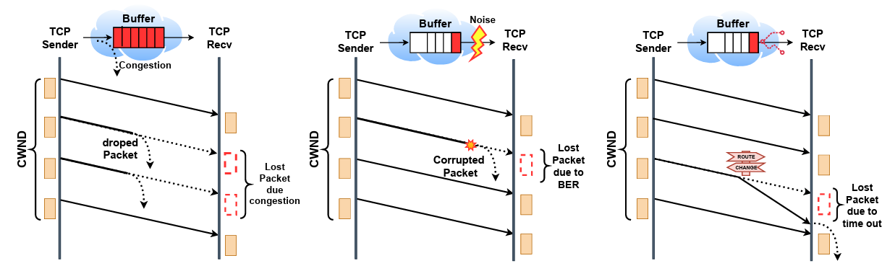
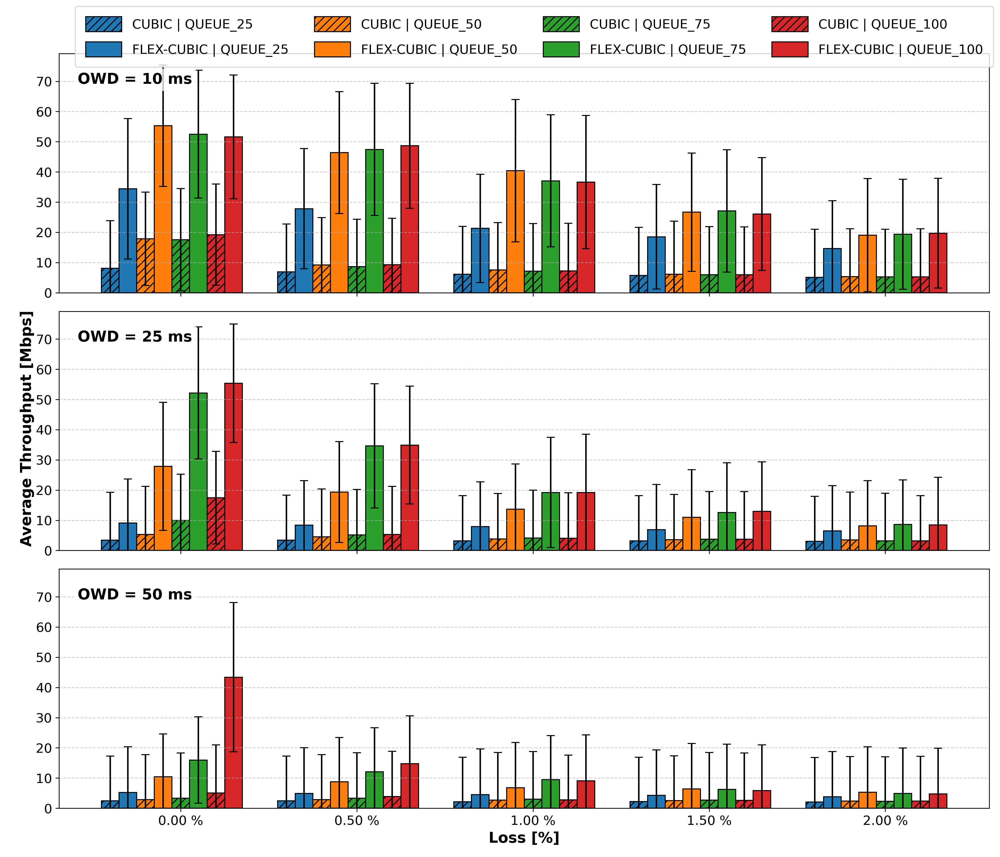
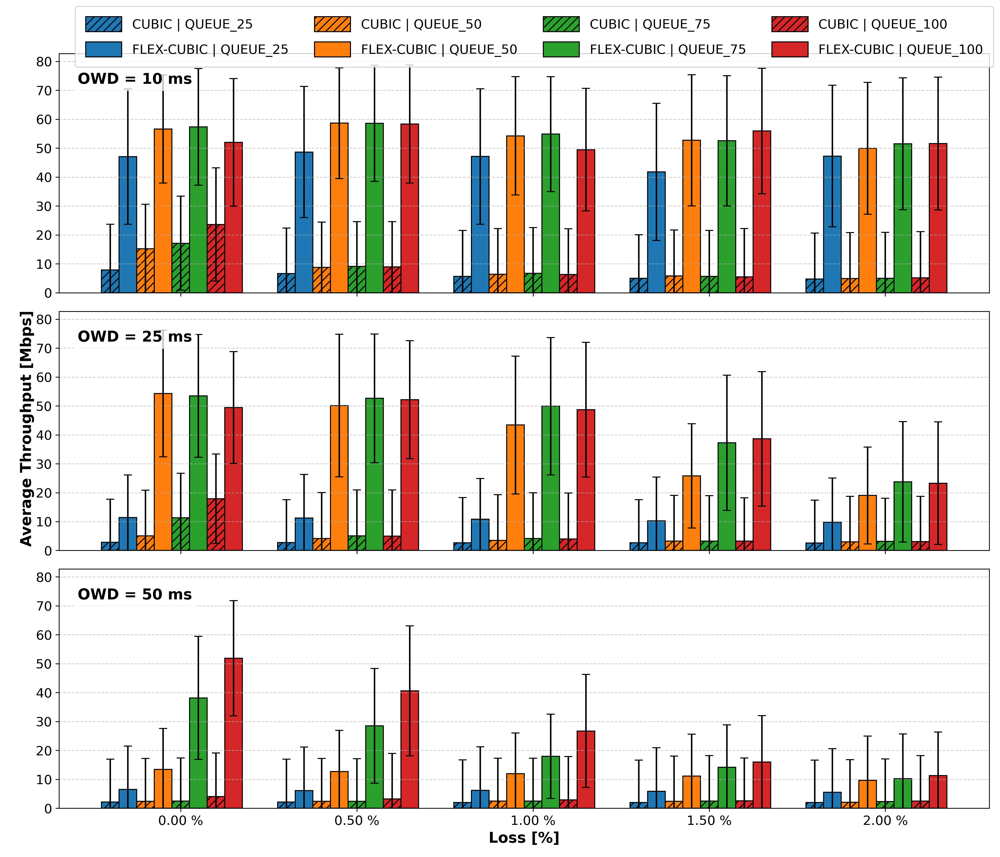
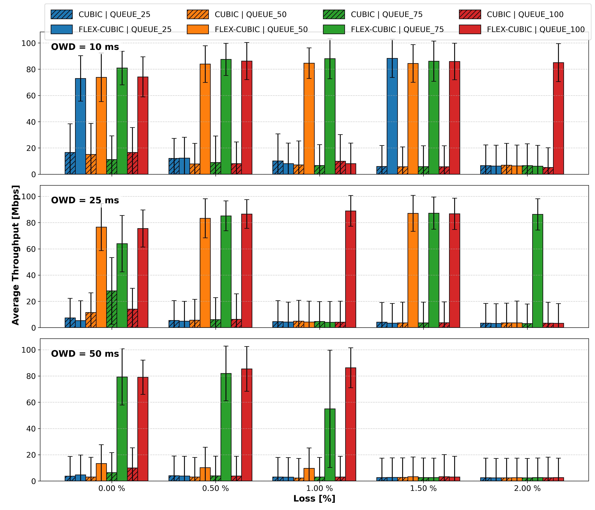

# Flex-Cubic: A Runtime-Adaptive Loss-Tolerant TCP Cubic

**Abstract**—Traditional TCP still lacks the ability to differentiate between losses primarily caused by congestion
from those caused by physical layer errors. This may severely impair performance, especially in data-intensive 
science applications over high-capacity and long-distance dynamically reconfigurable transparent optical networks. 
This work proposes and experimentally implements a variant of TCP Cubic designed for reconfigurable networks to 
turn transport layer tolerant to non-congestion losses and variable RTT exploiting available bandwidth more efficiently. 
This is done by designing a congestion window (cwnd) reduction mechanism that conditions loss reactions on evidence 
of congestion, given by RTT measurements. In addition, Flex-Cubic aims to supports dynamic parameter tuning and 
higherprecision timing, resulting in greater stability and improved bandwidth utilization. Thus, eBPF has been used 
as a platform for TCP congestion control algorithm (CCA) implementation, enabling new algorithms to be loaded into 
the kernel via JIT at runtime, without recompilation. Through struct ops and maps, eBPF allows per-flow instrumentation
and dynamically CCA adaptation.

**Index Terms** — *Congestion Control Algorithms, eBPF*

## Background and Related Work
A structural limitation remains in most CCAs in the differentiation between losses caused by congestion events, illustrated in Fig 1 (a), and those caused by corrupted bits at physical layer by noise and interference, which is depicted in Fig 2 (b). In long-distance optical fibers, free-space optical (FSO) links subject to atmospheric turbulence, and satellite communications links under noise and interference, a non-negligible fraction of packet losses stems from residual bit errors rate (BER), and not from buffer overload. 

**Fig 1** - *Discarding of packets due to: (a) buffer overload, (b) packet corruption, and (c) packet timeout.*

As a result, losses caused by corrupted packets are interpreted as congestion signals, causing cwnd reductions, unwarranted rate oscillations, and systematic under-utilization of available bandwidth. In this work, we focus on networks composed of high Bandwidth-Delay Product (BDP) links, where this effect is particularly severe, as window recovery after a reduction may require tens or hundreds of RTTs, significantly degrading average throughput, while also highlighting the behavior of loss-based algorithms.

In addition, there are strong dependence of congestion control on RTT. Route reconfigurations in adaptable networks may impose different propagation delays to in-flight packets of a given flow, as illustrated in Fig 1 (c) triggering a loss event. Classic performance models show that TCP throughput is proportional to cwnd/RTT and inversely proportional to $RTT \cdot \sqrt{p}$, where \textit{p} denotes the packet loss probability. Thus, links with high RTT require proportionally larger windows to fully exploit the available capacity. However, in modern networks, particularly in optical networks and Low Earth Orbit (LEO) satellite networks, this assumption is no longer valid. In these systems, RTT becomes a dynamic variable, subject to frequent sudden changes; and modern CCAs must be equipped with tools for facing such challenges. 

## Topology: TCP Cubic association with eBPF

For simplicity, a Dumbbell topology was adopted, with four hosts (H1-H2 and H3-H4 pairs), access and core switches Fig. 2. This configuration supports to evaluate the behavior of the TCP Cubic and Flex-Cubic algorithms when competing for bandwidth resources under network links with different one-way delay (OWD) values (10, 25, and 50 ms), packet loss rates ranging from 0\% to 2\% (introduced via \textit{tc}—traffic control) to emulate losses caused by corrupted packets at physical layer, and throttling of intermediate node buffer queues to values ranging from 100\% to 25\% of the bandwidth delay product (BDP) in order to intensify the response to packet overload. Here, the values of delays, and consequently values of minimum RTT (20, 50, and 100 ms). Each experiment involves two concurrent long-lived TCP flows sharing the bottleneck link, allowing controlled observation of bandwidth competition under identical configurations, and no background traffic was added to focus on TCP behavior under bit-error-induced losses. The experiment focused on the direct comparison between the standard TCP Cubic from the Linux kernel and the Flex-Cubic algorithm proposed in this work.

**Fig 2** - *Topology adopted and results of competition between two (partially overlapping) flows using standard TCP Cubic vs. Flex-Cubic with losses and queue bottlenecks.*

The behavior of TCP regarding the congestion window dynamics is strongly influenced by the parameters $\beta$ and \textit{C} of TCP Cubic Equations, which jointly govern the response to loss events and the evolution of the window during the congestion avoidance phase. The parameter $\beta$ defines the multiplicative decrease factor applied to the cwnd after a congestion event (Equations 1 and 2). In standard Cubic, $\beta \approx 0.7$ results in a moderate reduction of the congestion window, favoring fast throughput recovery in links with a high bandwidth–delay product (BDP). Values lower than the standard lead to an excessively aggressive reaction to losses, causing abrupt reductions in the cwnd and penalizing the average throughput, particularly in scenarios with non-congestive losses. Conversely, for higher values ($\beta > 0.7$), the reduction becomes less severe, resulting in a more aggressive sending behavior.

The parameter \textit{C} controls the constant of the cubic function is responsible for the growth of the cwnd over time. Higher values of \textit{C} produce a faster and more aggressive increase of the congestion window, allowing the flow to return more quickly to its previous maximum value. In contrast, reducing \textit{C} smooths the cubic growth curve, delaying the recovery of the cwnd.

The joint tuning of these parameters enables TCP Cubic to be adjusted toward more or less aggressive behavior, according to the constraints and operating conditions imposed by the network.

## Results

**Fig. 3** - *Throughput comparison between Cubic and Flex-Cubic (β = 0.3,C = 41)*

 

### Conclusion
This work presented TCP Flex-Cubic, a CCA derived from TCP Cubic and enhanced with eBPF features support toward runtime adaptability. TCP Flex-Cubic may dynamically follow communication link conditions and, when compared to traditional TCP Cubic, offers the additional capability to differentiate between packet losses caused by queue overload at intermediate nodes and losses induced by physical layer impairments effects. This work extends our previous studies on the dynamic adaptability of TCP CCAs to physical-layer constraints and the requirements of loss-sensitive applications, such as Data-Intesive Science (DiS), leveraging additional metrics toward cross-layer approaches.

The integration of the maps eBPF tool with the TCP congestion control algorithm (CCAs) was discussed in details, offering an alternative to the static algorithms traditionally implemented in the Linux kernel. This integration allows for dynamic interaction between runtime metrics and CCA control variables, representing a substantial evolution of TCP by enabling adaptation to networks with non-static characteristics, including satellite, FSO, and optical networks with disjoint paths and heterogeneous properties.

Future works will progress toward larger scale tests for Flex-Cubic with multihop flows competing with background traffic and under physical layer reconfiguration toward TE studies, which will include Cubic parameter optimization according to current perceived network states.   

**Fig. 4** - *Throughput comparison between Cubic and Flex-Cubic (β = 0.7,C = 41)*

